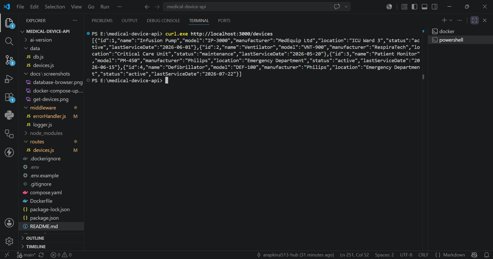
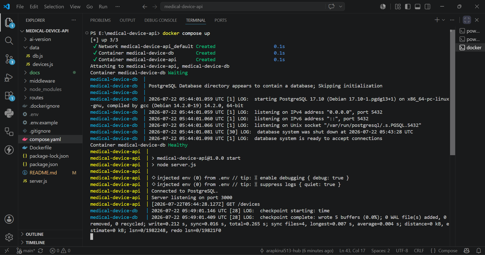
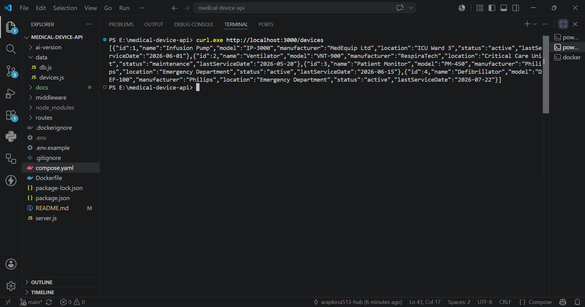

# Medical Device Inventory API


A RESTful backend service for managing medical device inventory, built with **Node.js**, **Express**, **PostgreSQL**, and **Docker**.

The project demonstrates layered backend architecture, repository pattern, environment-based configuration, PostgreSQL integration, and containerized deployment using Docker Compose.

---

## Features

- RESTful CRUD API
- PostgreSQL database
- Repository pattern
- Layered architecture
- Automatic database initialization
- Automatic sample data seeding
- Environment-based configuration
- Dockerized application
- Docker Compose deployment
- Persistent PostgreSQL storage using Docker volumes

---

## Technology Stack

| Technology | Purpose |
|------------|---------|
| Node.js | Runtime |
| Express.js | REST API |
| PostgreSQL 17 | Database |
| pg | PostgreSQL driver |
| Docker | Containerization |
| Docker Compose | Multi-container orchestration |

---

# Project Structure

```text
medical-device-api/
│
├── data/
│   ├── db.js
│   └── devices.js
│
├── middleware/
│   ├── errorHandler.js
│   └── logger.js
│
├── routes/
│   └── devices.js
│
├── docs/
│   └── screenshots/
│       ├── docker-compose-up.png
│       ├── database-browser.png
│       └── get-devices.png
│
├── .dockerignore
├── .env.example
├── .gitignore
├── compose.yaml
├── Dockerfile
├── package.json
├── package-lock.json
├── server.js
└── README.md
```

---

# Architecture

## Request Flow

```text
                Client
                  │
          GET /devices
                  │
                  ▼
          Express Router
                  │
                  ▼
        Device Repository
                  │
                  ▼
          PostgreSQL Driver
                  │
                  ▼
            PostgreSQL DB
                  │
                  ▼
          JSON Response
```

The project follows a layered architecture.

- **Routes** receive HTTP requests.
- **Repository** executes SQL queries.
- **Database layer** manages PostgreSQL connection, schema creation, and database initialization.

---

# Container Architecture

```text
                  +-----------------------+
                  |      Client           |
                  | (curl / Postman)      |
                  +-----------+-----------+
                              |
                              ▼
                  +-----------------------+
                  |   API Container       |
                  |-----------------------|
                  | Node.js               |
                  | Express               |
                  | Repository Layer      |
                  +-----------+-----------+
                              |
                    Docker Network
                              |
                              ▼
                  +-----------------------+
                  | PostgreSQL Container  |
                  |-----------------------|
                  | PostgreSQL 17         |
                  | Persistent Volume     |
                  +-----------+-----------+
                              |
                              ▼
                    Docker Volume
                 (Persistent Storage)
```

---

# Getting Started

## Prerequisites

- Docker Desktop
- Docker Compose

---

## Clone the repository

```bash
git clone https://github.com/arapkirui513-hub/medical-device-inventory-api.git

cd medical-device-inventory-api
```

---

## Environment Variables

Create a `.env` file from `.env.example`.

Example:

```env
DATABASE_URL=postgres://postgres:dev@db:5432/tasks
PORT=3000
```

---

# Run the Application

Build and start the complete application:

```bash
docker compose up --build
```

The API will be available at:

```text
http://localhost:3000
```

---

## Stop the Application

```bash
docker compose down
```

Because PostgreSQL uses a Docker volume, your data persists across container restarts.

---

# API Endpoints

| Method | Endpoint | Description |
|---------|----------|-------------|
| GET | `/devices` | Retrieve all medical devices |
| GET | `/devices/:id` | Retrieve a single device |
| POST | `/devices` | Create a device |
| PUT | `/devices/:id` | Update a device |
| DELETE | `/devices/:id` | Delete a device |

---

# Example HTTP Response

The following example shows a successful request using `curl -i`, including the HTTP status code, response headers, and JSON payload.

### Request

```bash
curl -i http://localhost:3000/devices/1
```

### Response

```http
HTTP/1.1 200 OK
X-Powered-By: Express
Content-Type: application/json; charset=utf-8
Content-Length: 152
ETag: W/"98-+MrtI/GhGlK1YvR433PhCcyZ6Do"
Date: Wed, 22 Jul 2026 06:41:20 GMT
Connection: keep-alive
Keep-Alive: timeout=5

{
  "id": 1,
  "name": "Infusion Pump",
  "model": "IP-3000",
  "manufacturer": "MedEquip Ltd",
  "location": "ICU Ward 3",
  "status": "active",
  "lastServiceDate": "2026-06-01"
}
```

### Error Example

```bash
curl -i http://localhost:3000/devices/abc
```

```http
HTTP/1.1 400 Bad Request
Content-Type: application/json; charset=utf-8

{
  "error": "Invalid device ID"
}
```

---

## Update Behavior

The `PUT /devices/:id` endpoint supports partial updates.

Any fields omitted from the request retain their existing values in the database.

Example:

```json
{
  "status": "maintenance"
}
```

The request above updates only the device status while preserving all other fields.

---

# Example Request

### POST /devices

```json
{
  "name": "ECG Machine",
  "model": "ECG-500",
  "manufacturer": "GE Healthcare",
  "location": "Cardiology",
  "status": "active",
  "lastServiceDate": "2026-07-22"
}
```

---

# Example Response

```json
{
  "id": 4,
  "name": "ECG Machine",
  "model": "ECG-500",
  "manufacturer": "GE Healthcare",
  "location": "Cardiology",
  "status": "active",
  "lastServiceDate": "2026-07-22"
}
```

---

# Database Initialization

On first startup the application automatically:

- Creates the `devices` table if it does not exist.
- Seeds three sample medical devices.
- Connects the application to PostgreSQL.

Subsequent restarts preserve existing data and do not reseed the database.

---

## Data Persistence

PostgreSQL stores its data in a Docker volume, allowing records to survive container restarts.

### Verification

1. Created a new medical device.
2. Stopped the application using:

```bash
docker compose down
```

3. Started the application again:

```bash
docker compose up
```

4. Retrieved all devices and confirmed the newly created record was still present.



---

# Docker Services

| Service | Description |
|----------|-------------|
| API | Node.js + Express |
| Database | PostgreSQL 17 |
| Storage | Docker Volume |

---

# Screenshots

## Docker Compose

Application running with both API and PostgreSQL containers.



---

## Database

Medical devices stored in PostgreSQL.


---

## API Response

Retrieving all devices from the PostgreSQL API.



---

# Development

Install dependencies:

```bash
npm install
```

Run locally:

```bash
npm start
```

---

# Key Learning Outcomes

This project demonstrates:

- Designing RESTful APIs with Express
- Repository pattern implementation
- PostgreSQL integration
- Environment-based configuration
- Database initialization and seeding
- Docker containerization
- Docker Compose orchestration
- Persistent storage with Docker volumes
- Layered backend architecture

---

# AI Implementation Comparison

To evaluate AI-generated code, I created a separate implementation using a single prompt and saved it in the `ai-version/` directory. I then compared the generated implementation with my final project by reviewing the generated code and attempting to run both implementations independently using Docker Compose.

## Prompt

> Build a REST API for managing medical devices using Node.js and Express. Store the data in PostgreSQL running in Docker. Use Docker Compose to start both the API and database. Read configuration from environment variables, create the database table automatically if it does not exist, seed sample data on first run, and implement CRUD endpoints for creating, retrieving, updating, and deleting devices.

---

## Comparison

| Area | AI Implementation | Final Implementation |
|------|-------------------|----------------------|
| Database | Generated a PostgreSQL container but the application still imported `better-sqlite3`, preventing the API from starting. | Fully migrated from SQLite to PostgreSQL using the `pg` driver. |
| Application Startup | API container exited during startup with a missing dependency (`better-sqlite3`). | API connected successfully to PostgreSQL and started normally. |
| Validation | Could not be verified because the API failed before serving requests. | Validates invalid route parameters and returns `400 Bad Request` for malformed IDs. |
| Error Responses | Not verified because the application did not start. | Returns consistent JSON error responses that match the assignment specification. |
| Testing | Runtime testing could not be completed due to the startup failure. | Successfully tested all CRUD endpoints, Docker deployment, and data persistence. |

---

## Key Differences

### 1. Database Migration

The AI-generated project created a PostgreSQL container but did not complete the migration from SQLite. During startup the application failed with:

```text
Error: Cannot find module 'better-sqlite3'
```

The final implementation replaces SQLite completely with PostgreSQL using the `pg` library.

---

### 2. Runtime Validation

The AI-generated implementation could not be exercised because the API exited during startup.

The final implementation was tested successfully and supports:

- Automatic database initialization
- One-time seed data
- Complete CRUD operations
- Docker Compose deployment
- Persistent PostgreSQL storage

---

### 3. Request Validation

During development, I identified that invalid IDs (for example, `GET /devices/abc`) produced a database error.

The final implementation validates route parameters before executing database queries and returns:

```http
HTTP/1.1 400 Bad Request

{
  "error": "Invalid device ID"
}
```

This prevents invalid input from reaching PostgreSQL and matches the assignment's required error format.

---

## Reflection

The comparison showed that AI-generated code can provide a useful starting point but still requires careful validation. While the generated implementation produced much of the project structure, it contained dependency and runtime issues that prevented the application from starting successfully.

Completing the project required debugging, testing, validating Docker configuration, refining error handling, and verifying the application through end-to-end testing. The final implementation reflects those engineering decisions rather than relying solely on generated code.

---

# Author

**Kevin Kirui**

Healthcare AI Product Systems Specialist  
Biomedical Engineering | Backend Development | Healthcare AI Systems

- GitHub: https://github.com/arapkirui513-hub
- LinkedIn: https://www.linkedin.com/in/kevin-kirui-ba9593275/