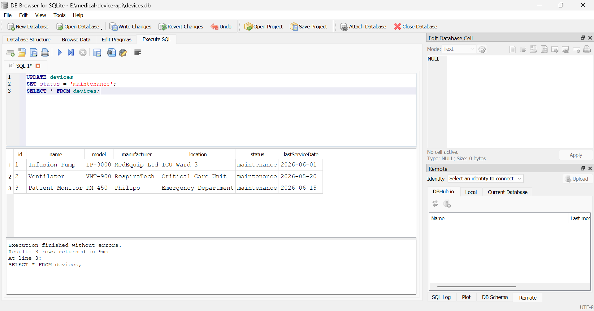

# Medical Device Inventory API

A RESTful API built with **Node.js**, **Express.js**, and **SQLite** for managing a medical device inventory. The project demonstrates RESTful CRUD operations, Express routing, middleware, JSON request handling, and persistent data storage using SQLite.

---

## Features

- Health check endpoint
- View all medical devices
- View a single device by ID
- Add a new device
- Update an existing device
- Delete a device
- Persistent data storage with SQLite
- Automatic database and table creation
- Automatic sample data seeding on first run
- Request logging middleware
- Centralized error-handling middleware
- JSON request parsing

---

## Tech Stack

- Node.js
- Express.js
- SQLite
- better-sqlite3

---

## Why SQLite?

SQLite was chosen because it:

- Requires no separate database server
- Stores all data in a single database file
- Is lightweight and easy to set up
- Persists data after server restarts
- Is well suited for learning SQL and backend persistence

Unlike the original implementation, which stored devices in memory, this version stores all device records inside a SQLite database.

---

## Database Location

The database is automatically created the first time the application runs.

```
devices.db
```

Project structure:

```
medical-device-inventory-api/
│
├── devices.db
├── server.js
├── package.json
└── ...
```

> **Note:** `devices.db` is excluded from Git using `.gitignore` because it is automatically generated.

---

## Database Initialization

When the server starts it automatically:

- Creates the SQLite database if it does not exist
- Creates the `devices` table if it does not exist
- Inserts three sample medical devices only when the table is empty

This allows anyone cloning the repository to start the project without manually creating a database.

---

## Installation

Clone the repository:

```bash
git clone <your-github-repository-url>
```

Navigate into the project:

```bash
cd medical-device-inventory-api
```

Install dependencies:

```bash
npm install
```

Start the server:

```bash
npm start
```

The API runs at:

```
http://localhost:3000
```

---

## API Endpoints

### Health Check

| Method | Endpoint |
|---------|----------|
| GET | `/` |

Response:

```json
{
  "message": "Medical Device API is running"
}
```

---

### Get All Devices

| Method | Endpoint |
|---------|----------|
| GET | `/devices` |

---

### Get Device by ID

| Method | Endpoint |
|---------|----------|
| GET | `/devices/:id` |

Example:

```
GET /devices/1
```

---

### Add Device

| Method | Endpoint |
|---------|----------|
| POST | `/devices` |

Example request body:

```json
{
  "name": "ECG Machine",
  "model": "ECG-200",
  "manufacturer": "Philips",
  "location": "Cardiology",
  "status": "active",
  "lastServiceDate": "2026-07-20"
}
```

---

### Update Device

| Method | Endpoint |
|---------|----------|
| PUT | `/devices/:id` |

Example:

```json
{
  "status": "maintenance"
}
```

---

### Delete Device

| Method | Endpoint |
|---------|----------|
| DELETE | `/devices/:id` |

---

## Example Device

```json
{
  "id": 1,
  "name": "Infusion Pump",
  "model": "IP-3000",
  "manufacturer": "MedEquip Ltd",
  "location": "ICU Ward 3",
  "status": "active",
  "lastServiceDate": "2026-06-01"
}
```

---

## SQLite CRUD Operations

| Operation | SQL Statement |
|------------|---------------|
| Read All | `SELECT * FROM devices` |
| Read One | `SELECT * FROM devices WHERE id = ?` |
| Create | `INSERT INTO devices (...) VALUES (...)` |
| Update | `UPDATE devices SET ... WHERE id = ?` |
| Delete | `DELETE FROM devices WHERE id = ?` |

---

## Example SQL Query

The following SQL query was executed during development:

```sql
SELECT *
FROM devices
WHERE status = 'active';
```

This query returns only medical devices that are currently marked as active.

---

## Database Screenshot

The screenshot below shows the **devices** table opened in **DB Browser for SQLite** after completing the SQLite migration.



---

## Project Structure

```
medical-device-inventory-api/
│
├── data/
│   ├── db.js
│   └── devices.js
│
├── middleware/
│   ├── logger.js
│   └── errorHandler.js
│
├── routes/
│   └── devices.js
│
├── devices.db
├── .gitignore
├── server.js
├── package.json
└── README.md
```

---

## Architecture

The REST API remained exactly the same throughout the migration.

Clients still use:

- `GET /devices`
- `GET /devices/:id`
- `POST /devices`
- `PUT /devices/:id`
- `DELETE /devices/:id`

Only the persistence layer changed.

### Before

```
Client
    │
    ▼
Express API
    │
    ▼
In-memory JavaScript Array
```

### After

```
Client
    │
    ▼
Express API
    │
    ▼
SQLite Database
```

This demonstrates one of the key backend engineering principles:

> The API defines **what** the application does, while the database defines **where** the application stores its data.

---

## Design Decisions

### Why SQLite?

SQLite provides persistent storage without requiring a separate database server, making it ideal for lightweight backend applications and learning SQL.

### Why AUTOINCREMENT?

The database owns identifier generation using:

```sql
INTEGER PRIMARY KEY AUTOINCREMENT
```

This guarantees unique IDs without requiring the application to calculate them manually.

### Why Validation Happens in Express

Business rules such as required fields and default values belong to the API layer.

The database stores validated data but does not decide what values should be assigned when the client omits them.

---

## Assignment Objectives Demonstrated

- Express server setup
- RESTful API design
- CRUD operations
- Route parameters
- Middleware
- JSON request handling
- Error handling
- SQLite integration
- SQL CRUD operations
- Automatic database creation
- Persistent data storage

---

## Testing

The API was tested using:

- Thunder Client
- DB Browser for SQLite

### Tested Endpoints

- GET /
- GET /devices
- GET /devices/1
- POST /devices
- PUT /devices/1
- DELETE /devices/1

### SQL Queries Executed

```sql
SELECT * FROM devices;
```

```sql
SELECT * FROM devices WHERE status = 'active';
```

```sql
SELECT COUNT(*) AS total_devices FROM devices;
```

```sql
UPDATE devices
SET status = 'maintenance';
```

```sql
DELETE FROM devices
WHERE status = 'maintenance';
```

---

## Learning Outcomes

This project demonstrates how an application can migrate from an in-memory data store to a persistent SQLite database without changing its REST API.

The API contract remained unchanged while the persistence layer evolved, illustrating the separation of concerns between application logic and data storage.
